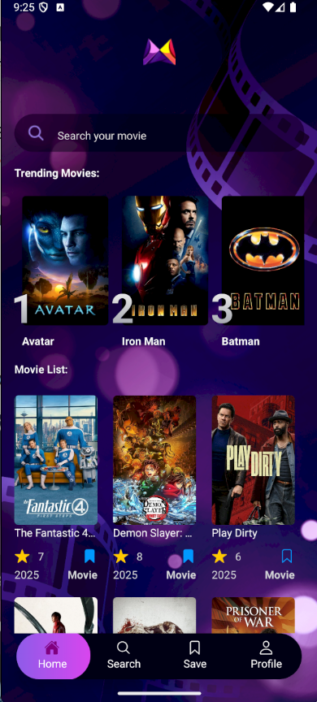

### 🎬 Movie Explorer App

This is a React Native mobile application built with Expo that allows users to discover popular movies, view trending searches, and manage their saved movies — all with smooth infinite scrolling and efficient data fetching.

**Here’s how the UI reacts instantly when saving or unsaving a movie** 👇




✨ Features

- 🔥 Popular Movies: Displays the most popular movies of the moment.
- 📈 Top 5 Trending Searches: Shows the five most searched movies by users.
- ♾️ Infinite Scrolling: Implements infinite query loading with React Query to improve performance when the user scrolls to the end of the list.

💾 Saved Movies Management:

- Makes a single request on the Home screen to fetch all saved movies for the user.
- Uses that cached data in the Saved page to avoid unnecessary requests.
- Marks saved movies directly on the Home screen.

⚡ React Query Integration:

- Efficient caching and background updates for better UX.
- Implements rollback updates for optimistic UI when saving or unsaving a movie.

🔍 Search History & Trending:

- Saves users' previous search results locally.
- Identifies the most searched movies and displays them as “trending.”

🛠️ Tech Stack

- React Native
- Expo
- React Query
- TypeScript
- NativeWind (Tailwind for React Native)
- Ionicons for icons

### 🚀 Getting Started

1. Clone the repository

```bash
git clone https://github.com/Ehabzakout/rn-movie-app.git
cd movie-app
```

2. Install dependencies

```bash
npm install
```

3. Run the project

```bash
npx expo start

Scan the QR code with the Expo Go app on your phone to preview.
```

📌 Project Structure
src/

├─ components/ # Reusable UI components
├─ service/ # API services & React Query hooks
├─ assets/ # Images and icons
├─ App # App screens (Home, Saved, Search, etc.)
├─ constants # constant values
├─ types # types

- 🧠 Key Implementation Details

* Home screen fetches popular movies and the saved movies for the current user.
* Infinite queries are implemented to reduce load time and provide smooth pagination.
* The saved movies are managed through React Query cache to avoid redundant network calls.
* Optimistic updates and rollback ensure UI updates instantly when saving/unsaving.

## 📝 Environment Variables

You need to create a **`.env`** file in the root of the project to store your database configuration and other sensitive values.
